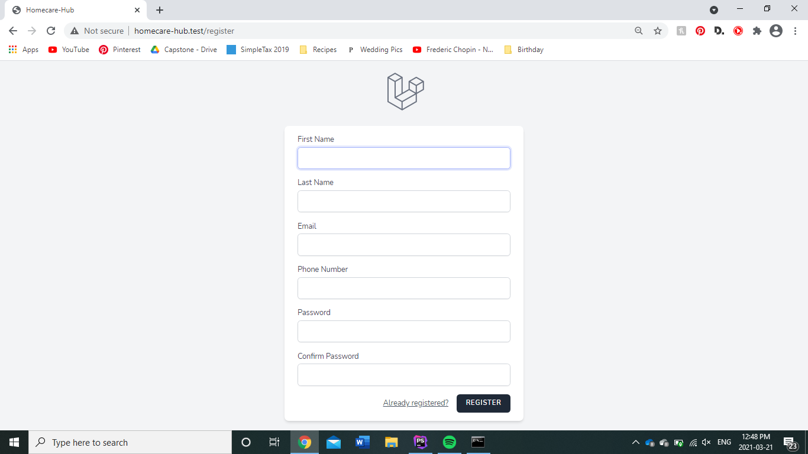
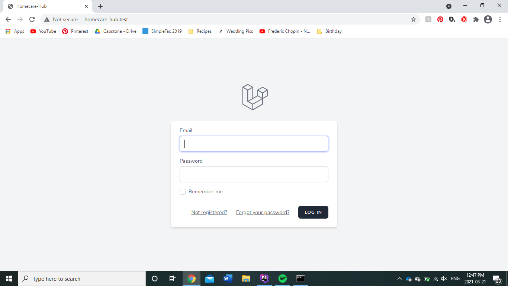
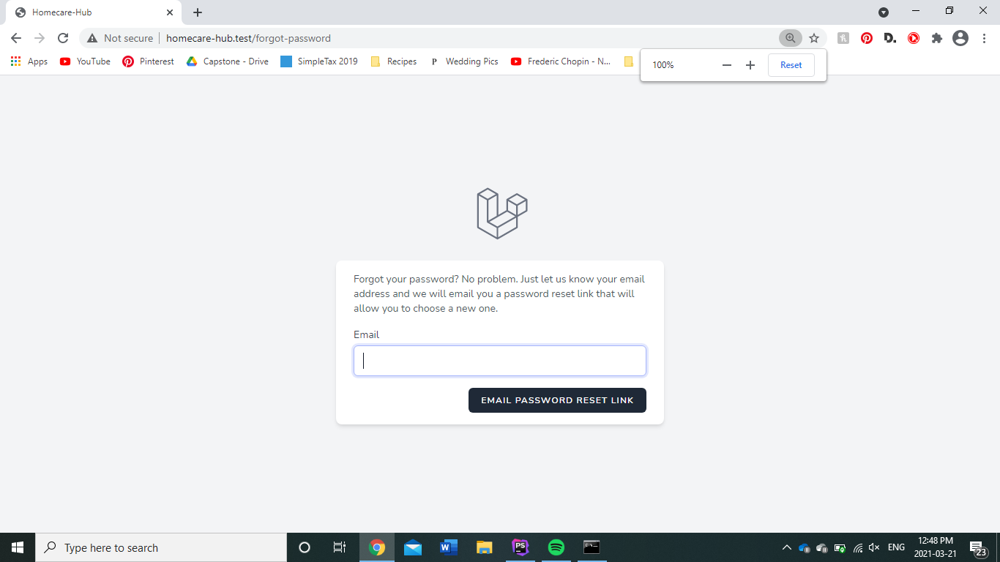
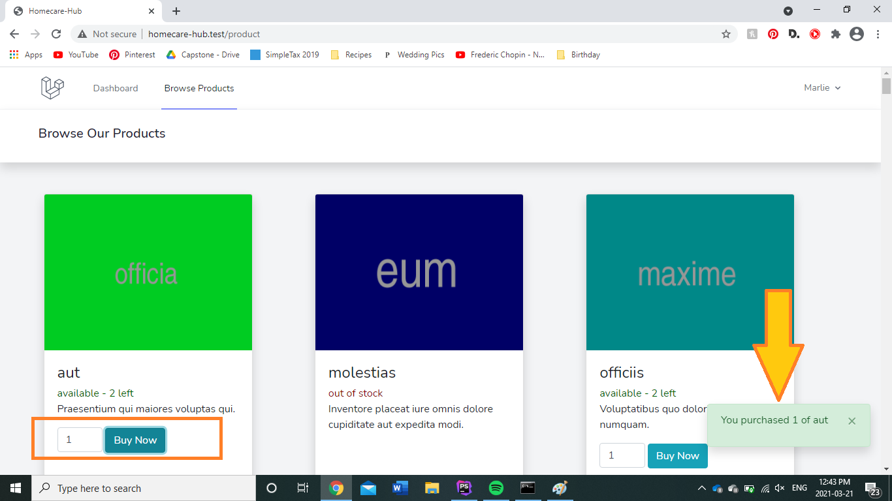
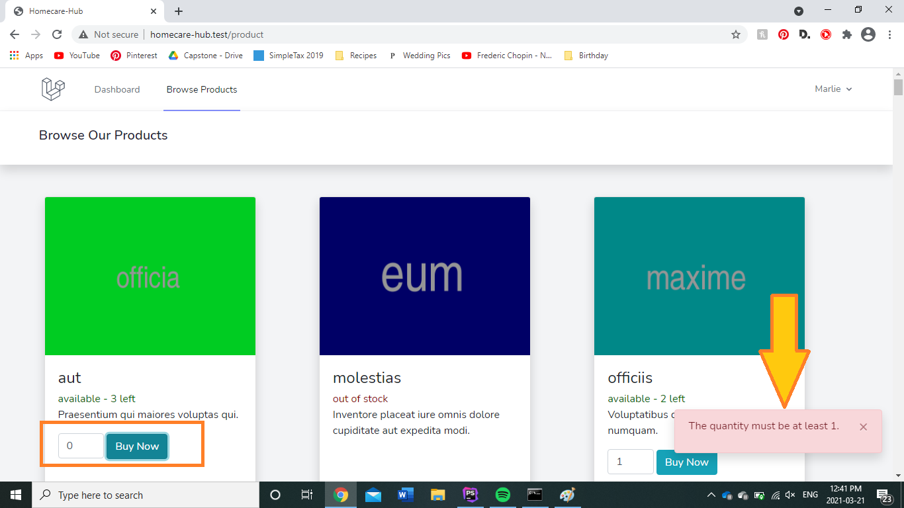
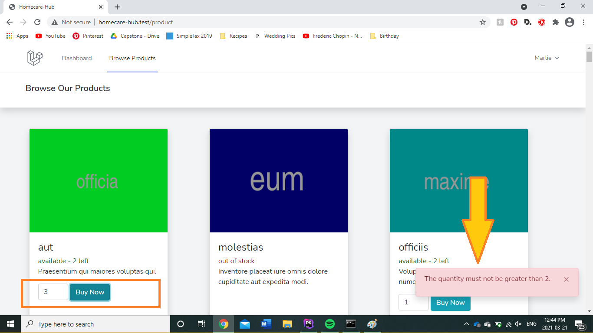
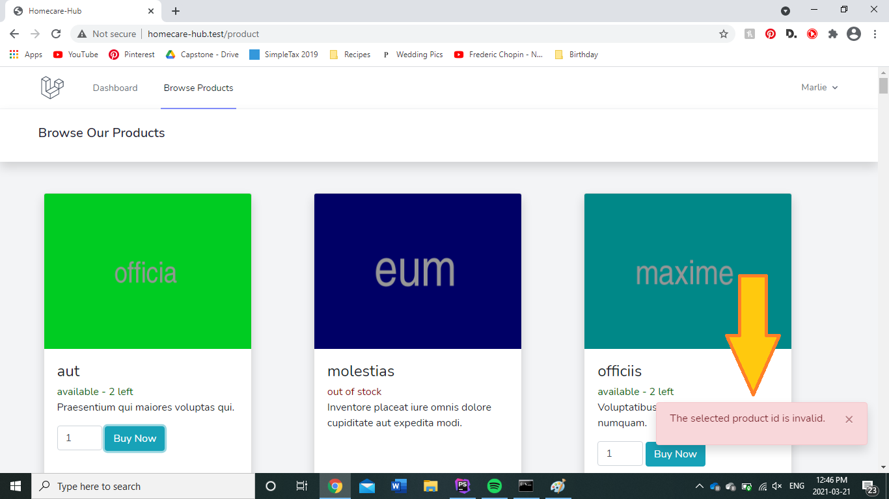
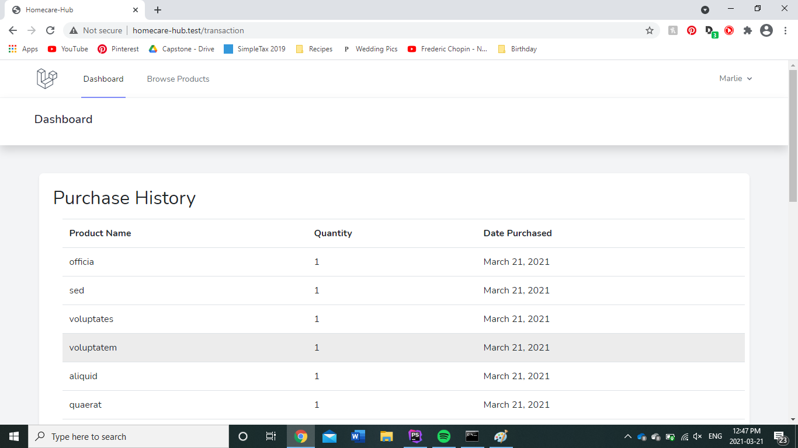

## Homecare Hub Aptitude Test

By Marlie Dueck

Objective: Create a basic web application using Laravel to allow signed-in users to view a list of
products and ‘purchase’ them. 

A demo of this application can be found [here](https://homecare-hub.herokuapp.com).

### Using the Program
When you first open the URL, you can login or register. If you forget your password, just use the password reset link 
(MailTrap is enabled, so you won't actually receive the email confirmation). 

Once you are logged in, browse the products page. You can buy a product by selecting a quantity and clicking "Buy Now".
 If the transaction is successful, you will get a small green notification in the bottom right corner. If you put in a 
 quantity of 0 or a quantity above the available amount, the transaction will fail and you will receive an error message 
 in the bottom right hand corner. If you attempt to purchase an item that does not exist, you will receive an error 
 message in the bottom right hand corner.
 

View your transaction history by clicking the "Dashboard" tab at the top.

### Steps to Clone the Project for Development
Homestead is the recommended virtual machine for Laravel development. Follow the [Laravel documentation](https://laravel.com/docs/7.x/homestead) to install and configure Homestead.
1. Clone this GitHub repository to your local development environment.

2. Run the following commands to install project packages and dependencies:

        composer install
        npm install
        
3. Create a .env file and set the environment variables. You can find an example .env file for Laravel [here](https://github.com/laravel/laravel/blob/7.x/.env.example).

4. For testing, create a .env.testing file and set the environment variables to connect to the database you plan on using for testing. Also set the APP_* environment variables.

## Learning Laravel

Laravel has the most extensive and thorough [documentation](https://laravel.com/docs) and video tutorial library of all modern web application frameworks, making it a breeze to get started with the framework.

If you don't feel like reading, [Laracasts](https://laracasts.com) can help. Laracasts contains over 1500 video tutorials on a range of topics including Laravel, modern PHP, unit testing, and JavaScript. Boost your skills by digging into the comprehensive video library.

